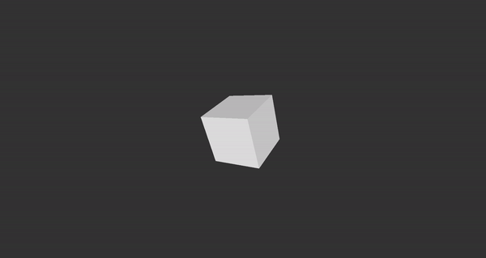
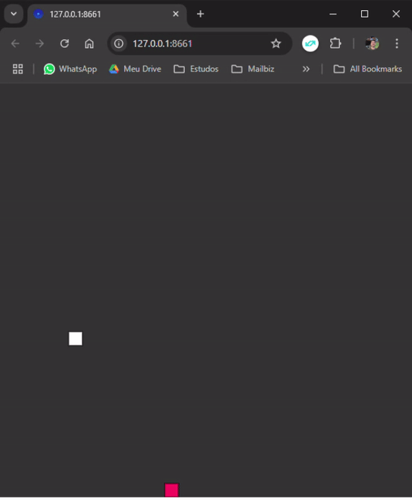

# Processing Projects

Este repositório foi criado para armazenar meus estudos sobre **Processing** e **p5.js**. Ele contém cinco projetos que exploram conceitos de arte generativa, simulações e interatividade.

---

## Projetos (PT-BR)

### 1. **PurpleRain**
Simula uma chuva roxa, com gotas caindo de forma a criar uma sensação de profundidade.

### 2. **MengerSponge**
Estudo do algoritmo conhecido como Menger Sponge, replicado em Processing.

### 3. **SnakeGame**
Uma implementação do clássico jogo da cobrinha usando **p5.js**.

### 4. **Starfield**
Simula uma visão de uma galáxia, onde a velocidade aumenta com o tempo e as estrelas e planetas se distorcem progressivamente.

### 5. **Walking_Ball**
Uma bola se move pela tela, e cada vez que toca em um canto, o background muda de cor.

---

## Projects (EN)

### 1. **PurpleRain**
Simulates a purple rain, with droplets falling in a way that creates a depth effect.

### 2. **MengerSponge**
Study of the algorithm known as Menger Sponge, replicated in Processing.

### 3. **SnakeGame**
An implementation of the classic Snake game using **p5.js**.

### 4. **Starfield**
Simulates a galaxy view, where the speed increases over time, and the stars and planets become increasingly distorted.

### 5. **Walking_Ball**
A ball moves across the screen, and every time it hits a corner, the background changes color.

---

## Proyectos (ES)

### 1. **PurpleRain**
Simula una lluvia morada, con gotas que caen de forma que crean un efecto de profundidad.

### 2. **MengerSponge**
Estudio del algoritmo conocido como Menger Sponge, replicado en Processing.

### 3. **SnakeGame**
Una implementación del clásico juego de la serpiente usando **p5.js**.

### 4. **Starfield**
Simula una visión de una galaxia, donde la velocidad aumenta con el tiempo y las estrellas y planetas se distorsionan progresivamente.

### 5. **Walking_Ball**
Una pelota se mueve por la pantalla y, cada vez que toca una esquina, el fondo cambia de color.

